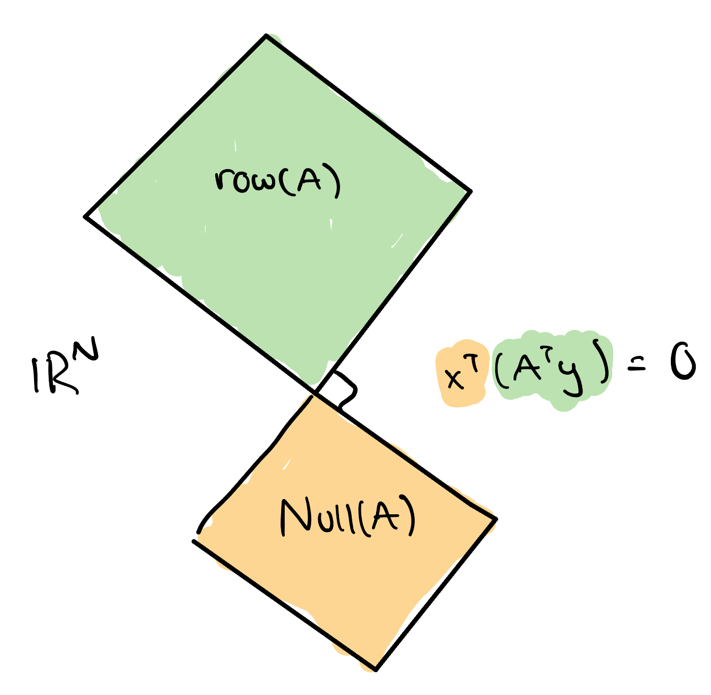

In this note we cover the four fundamental subspaces of a linear transformation that is learned in linear algebra: The null space, row space, column space, and left null space. 

Consider an $M \times N$ matrix $\boldsymbol{A}$. The four fundamental subspaces are:

### Null Space
Define the null space as the set of all vectors $\boldsymbol{z} \in \mathbb{R}^N$ that get mapped to the zero vector by the matrix $\boldsymbol{A}$:

$$
\text{Null}(\boldsymbol{A}) \triangleq \{\boldsymbol{z} \in \mathbb{R}^N: \boldsymbol{Az} = \boldsymbol{0}\}
$$

### Row Space
Define the row space as the span of the rows of $\boldsymbol{A}$. In other words, the row space is the set of all vectors that can be written as a linear combination of the rows of $\boldsymbol{A}$. Equivalently the rowspace is the set of all vectors that can be written as a linear combination of the *columns* of $\boldsymbol{A}^T$ :

$$
\text{Row}(\boldsymbol{A}) \triangleq \{\boldsymbol{z} \in \mathbb{R}^N: \boldsymbol{z} = \boldsymbol{A}^T\boldsymbol{y},\quad \boldsymbol{y}\in \mathbb{R}^M\}
$$

### Column Space
Define the column space as the span of the columns of $\boldsymbol{A}$. In other words, the column space is the set of all vectors that can be written as a linear combination of the columns of $\boldsymbol{A}$:

$$
\text{Col}(\boldsymbol{A}) \triangleq \{\boldsymbol{z} \in \mathbb{R}^M : \boldsymbol{z} = \boldsymbol{Ay}, \quad \boldsymbol{y} \in \mathbb{R}^N\}
$$

### Left Null Space
Define the left null space as the set of all vectors $\boldsymbol{z} \in \mathbb{R}^M$ that get mapped to the zero vector by the matrix $\boldsymbol{A}^T$:

$$
\text{Null}(\boldsymbol{A}^T) \triangleq \{\boldsymbol{z} \in \mathbb{R}^M: \boldsymbol{A}^T\boldsymbol{z} = \boldsymbol{0}\}
$$

## Orthogonal Complements

There are interesting relationships between elements of these subspaces that we will now explore. 

1. If $\boldsymbol{x} \in \text{Null}(\boldsymbol{A}) $ and $\boldsymbol{z} \in \text{Row}(\boldsymbol{A}) $, then $\boldsymbol{x}^T\boldsymbol{z}=0$. In other words, any element in the null space of $\boldsymbol{A}$ is orthogonal to any element in the row space of $\boldsymbol{A}$. In this case, we say that $\text{Null}(\boldsymbol{A})$ and $\text{Row}(\boldsymbol{A}) $ are *orthogonal complements* of each other.
    - Proof  
    Since $\boldsymbol{z} \in \text{Row}(\boldsymbol{A})$, let $\boldsymbol{z} = \boldsymbol{A}^T\boldsymbol{y}$ for some $\boldsymbol{y} \in \mathbb{R}^M$. Then,

    $$
    \begin{aligned}
        \boldsymbol{x}^T\boldsymbol{z} &= \boldsymbol{x}^T\boldsymbol{A}^T\boldsymbol{y} \\\ 
        &= \big(\boldsymbol{x}^T\boldsymbol{A}^T\boldsymbol{y}\big)^T & & \text{transpose of scalar equals itself} \\\ 
        &= \boldsymbol{y}^T\boldsymbol{Ax} \\\ 
        &= 0 & & \text{since } \boldsymbol{x} \in \text{Null}(\boldsymbol{A})
    \end{aligned}
    $$

<figure>
  
  <figcaption><i>Visualization of the null space and row space</i></figcaption>
</figure>

2. If $\boldsymbol{x} \in \text{Null}(\boldsymbol{A}^T) $ and $\boldsymbol{z} \in \text{Col}(\boldsymbol{A}) $, then $\boldsymbol{x}^T\boldsymbol{z}=0$. In other words, any element in the left null space of $\boldsymbol{A}$ is orthogonal to any element in the column space of $\boldsymbol{A}$. In other words, $\text{Null}(\boldsymbol{A}^T)$ and $\text{Col}(\boldsymbol{A}) $ are orthogonal complements of each other.
    - Proof  
    Since $\boldsymbol{z} \in \text{Col}(\boldsymbol{A})$, let $\boldsymbol{z} = \boldsymbol{A}\boldsymbol{y}$ for some $\boldsymbol{y} \in \mathbb{R}^N$. Then,

    $$
    \begin{aligned}
        \boldsymbol{x}^T\boldsymbol{z} &= \boldsymbol{x}^T\boldsymbol{A}^T\boldsymbol{y} \\\ 
        &= \big(\boldsymbol{x}^T\boldsymbol{A}\boldsymbol{y}\big)^T & & \text{transpose of scalar equals itself} \\\ 
        &= \boldsymbol{y}^T\boldsymbol{A}^T\boldsymbol{x} \\\ 
        &= 0 & & \text{since } \boldsymbol{x} \in \text{Null}(\boldsymbol{A}^T)
    \end{aligned}
    $$

<figure>
  
  <figcaption><i>Visualization of the left null space and column space</i></figcaption>
</figure>

## Decomposition of $\mathbb{R}^N$ and $\mathbb{R}^M$

The rank-nullility theorem helps us decompose $\mathbb{R}^N$ and $\mathbb{R}^M$.

  Rank Nullility Theorem  

  Let $\boldsymbol{A}$ be a $M \times N$ matrix. Then,

  $$
    \text{dim}\big[\text{Null}(\boldsymbol{A})\big] + \text{dim}\big[\text{Row}(\boldsymbol{A})\big] = N
  $$

The rank nullility theorem allows us to decompose $\mathbb{R}^N$ into a union of two disjoint sets: the null space and the row space. As such, we can write any element of $\mathbb{R}^N$ as a sum of an element from the null space and an element from the row space:

$$
  \boldsymbol{x} = \boldsymbol{x}_{\text{row}} + \boldsymbol{x}_{\text{null}}
$$

The rank nullility theorem also lets us make a statement about $\boldsymbol{A}^T$:

$$
  \text{dim}\big[\text{Null}(\boldsymbol{A}^T)\big] + \text{dim}\big[\text{Row}(\boldsymbol{A}^T)\big] = M
$$

The corresponding decomposition for any element in $\mathbb{R}^M$ is:

$$
  \boldsymbol{x} = \boldsymbol{x}_{\text{column}} + \boldsymbol{x}_{\text{left\_null}}
$$

These types of decompositions are used in finding minimum norm solutions to least squares problems when there are infinitely many solutions.

