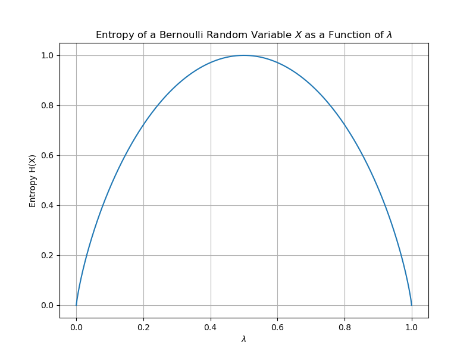

Suppose we have a random variable $X$ taking values in a set $\mathcal{X}$ and is distributed according to $p : \mathcal{X} \to [0, 1]$.

The information, $I$, of a particular sample of $X$, denoted by $x \in \mathcal{X}$, is defined as

$$
\begin{aligned}
I(x) &= \text{log}_2\Big(\frac{1}{p(x)}\Big) \\
     &= -\text{log}_2\Big(p(x)\Big)
\end{aligned}
$$

We see that for events $x$ that have low probability, the information is high, reflecting the fact that we are surprised to see a low probability event. In contrast, events with high probability have low information, reflecting the fact that we are unsurprised by observing an event that happens often. 

In essence, $\textbf{low probability events} \to \textbf{high information}.$

The expected value of the information is called the entropy, $H(X)$:

$$
\begin{aligned}
H(X) &\triangleq \mathbb{E}(I) \\ 
&= \mathbb{E}[-\text{log}_2(p(X))] \\
&= \sum_{x \in \mathcal{X}} -p(x)\ \text{log}_2(p(x))
\end{aligned}
$$

Where the expectation above is taken with respect to $X$. Entropy captures the notion of uncertainty in a random variable. If we are more uncertain of the outcome, the random variable has higher entropy. 

## Example
Consider a weighted coin whose probability of landed on heads is given by $\lambda$. We can consider the coin toss event as a discrete random variable $X$ taking on two values: 1 if it lands on heads and 0 if it lands tails. The distribution of $X$ is

$$
\begin{aligned}
p(x) = {\displaystyle {\begin{cases}\lambda&{\text{if }}x=1,\\1-\lambda&{\text{if }}x=0.\end{cases}}}
\end{aligned}
$$

If we plot the entropy $H(X)$ as a function of $\lambda$, we get:

<figure>
  
  <figcaption><i>Entropy of Bernoulli Random Variable</i></figcaption>
</figure>

At $\lambda = \frac{1}{2}$ we have the largest entropy because this is when the most uncertainty is in the random variable. The coin toss can go either way. Compare this to when $\lambda = \frac{3}{4}$, where we are more certain the coin will land heads, and thus the entropy is lower.

In essence, $\textbf{high uncertainty in random variable} \to \textbf{high entropy}.$

