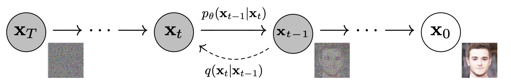

In this note, we describe diffusion models.

Diffusion models are latent variable models of the form $p_{\theta}(\mathbf{x}_0) = \int p_{\theta}(\mathbf{x}_{0:T})d\mathbf{x}_{1:T}$. Note that this expression is simply the marginal distribution of $\mathbf{x}_0$ assuming a joint distribution $p_{\theta}(\mathbf{x}_{0:T})$ exists. The marginal distribution can be found by integrating the remaining variables $\mathbf{x}_1, \mathbf{x}_2\ldots \mathbf{x}_T$ out of the joint distribution.

For diffusion models, the joint distribution takes the following form,
$$
\begin{equation}
p_{\theta}(\mathbf{x}_{0:T}) = p(\mathbf{x}_T)\prod\limits_{t=1}^{T} p_{\theta}(\mathbf{x}_{t-1} | \mathbf{x}_t)
\end{equation}
$$

## Reverse Process

Note that the joint disribution is constructed by an iterated product of conditional distributions, starting with $p(\mathbf{x}_T)$. Usually, diffusion models assume the following forms for the terms in Eq $(1)$:
$$
\begin{align*}
p(\mathbf{x}_T) &= \mathcal{N}(\mathbf{0}, \mathbf{I})\\ 
p_{\theta}(\mathbf{x}_{t-1} | \mathbf{x}_t) &= \mathcal{N}\big(\mathbf{x}_{t-1}; \boldsymbol{\mu}_{\theta}(\mathbf{x}_t, t), \boldsymbol{\Sigma}_{\theta}(\mathbf{x}_t, t)\big)
\end{align*}
$$ 

To get a sample $x \sim p_{\theta}(\mathbf{x}_0)$, we start by sampling from $p(\mathbf{x}_T)$ and then sample each of the conditional distributions in a chain. This is referred to as the reverse process. A diagram is shown below.

<figure>
  
  <figcaption><i>The reverse process in diffusion</i></figcaption>
</figure>

## Forward Process
In diffusion models, the forward process is fixed to a markov chain. The transition between two successive states is defined by a gaussian distribution.

$$
\begin{aligned}
q(\mathbf{x}_t | \mathbf{x}_{t-1}) = \mathcal{N}(\sqrt{1-\beta_t}\mathbf{x}_{t-1}; \beta_t\mathbf{I})
\end{aligned}
$$

The collection $\{\beta_t\}_{t=1}^{T}$ defines the $\it{\text{variance schedule}}$ of the diffusion process and is often fixed (not learned via training).

