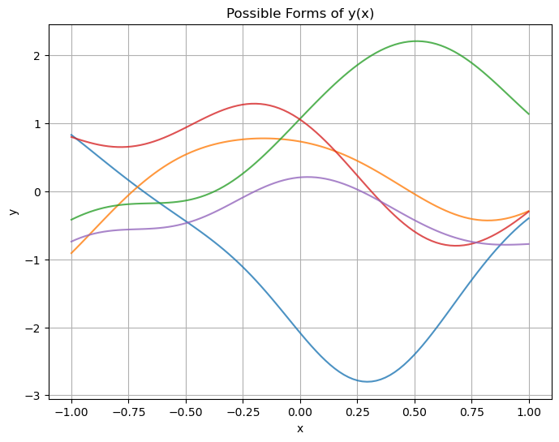
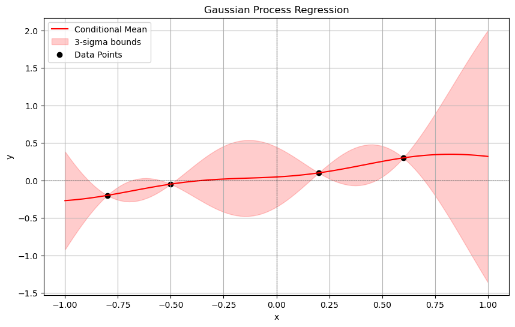

Goal is to find a regressor $y(\mathbf{x}):\mathbb{R}^d \to \mathbb{R}$ that fits observed data $\mathcal{D} = \{\mathbf{x}_i, y_i\}$. 
## Prior
Prior to observing the data, we have no idea what $y(\mathbf{x})$ can be. To reflect this, our prior over $y(\mathbf{x})$ will be a gaussian process:

$$
\begin{aligned}
y(\mathbf{x}) &\sim GP(\mu(\mathbf{x}), k(\mathbf{x}, \mathbf{x}')) \\ 
k(\mathbf{x}, \mathbf{x}') &= \exp{(-\frac{1}{2\sigma^2} \|\mathbf{x} - \mathbf{x}'\|^2)}
\end{aligned}
$$

Here are some possible forms we believe $y(\mathbf{x})$ can take prior to observing any data ($\mu(\mathbf{x}) = 0$).

<figure>
  
  <figcaption><i>Five samples of the Gaussian process with mean function zero and sigma (length scale) equal to 0.5</i></figcaption>
</figure>

## Posterior
Given the observed data $\{\mathbf{x}_i, y_i \}$, how do we update our belief of the possible forms $y(\mathbf{x})$ can take? Let $\mathbf{y}$ be a finite vector of random variables from the gaussian process. One possible collection could be $\mathbf{y} = [y(-0.1),\  y(0.2),\  y(0.5)]^\top$. Let us split this vector into $\mathbf{y} = [\mathbf{y}_1, \mathbf{y}_2]^\top$, where $\mathbf{y}_1$ is the observed data and $\mathbf{y}_2$ is the unobserved data. We know that under our prior, $\mathbf{y}$ is a multivariate normal distribution.

$$
\begin{bmatrix}
\mathbf{y}_1 \\
\mathbf{y}_2
\end{bmatrix}
\sim \mathcal{N}\left(
\begin{bmatrix}
\boldsymbol{\mu}_1 \\
\boldsymbol{\mu}_2
\end{bmatrix},
\begin{bmatrix}
\Sigma_{11} & \Sigma_{12} \\
\Sigma_{21} & \Sigma_{22}
\end{bmatrix}
\right)

$$

The conditional distribution $\mathbf{y}_2 \| \mathbf{y}_1$ is also normal and is given by

$$
\begin{aligned}
\mathbf{y}_2 | \mathbf{y}_1 &\sim \mathcal{N}(\boldsymbol{\mu}_{2|1}, \Sigma_{2|1})\\ 
\boldsymbol{\mu}_{2|1} &= \boldsymbol{\mu}_2 + \Sigma_{21} \Sigma_{11}^{-1} (\mathbf{y}_1 - \boldsymbol{\mu}_1) \\ 
\Sigma_{2|1} &= \Sigma_{22} - \Sigma_{21} \Sigma_{11}^{-1} \Sigma_{12}
\end{aligned}
$$

In the GPR case, we analogously update the mean function and covariance kernel. Let us take our dataset $\mathcal{D} = \{\mathbf{x}_i, y_i\}$ and create the vectors $\mathbf{y}_1:=[y_1, y_2, \ldots y_n]^\top$ and $\boldsymbol{\mu}_1 := [\mu(\mathbf{x}_1), \mu(\mathbf{x}_2), \ldots \mu(\mathbf{x}_n)]^\top$. Note that in our case, we assume in our prior that $\mu(\mathbf{x}) = 0$, which implies that $\boldsymbol{\mu}_1 = 0$. We continue with the more general case. The posterior mean and covariance kernel are now written as

$$
\begin{aligned}
\mu(\mathbf{x}) | \mathcal{D} &= \mu(\mathbf{x}) + \Sigma_{21}\Sigma_{11}^{-1}(\mathbf{y}_1 - \boldsymbol{\mu}_1) \\ 
k(\mathbf{x}, \mathbf{x}') | \mathcal{D} &= k(\mathbf{x}, \mathbf{x}') - \Sigma_{21} \Sigma_{11}^{-1} \Sigma_{12}
\end{aligned}
$$

Where $\Sigma_{21}  = [k(\mathbf{x}, \mathbf{x}\_1),\  k(\mathbf{x}, \mathbf{x}\_2),\  \ldots, k(\mathbf{x}, \mathbf{x}\_n)] = \Sigma_{12}^\top$ and $\Sigma_{11}[i, j] = k(\mathbf{x}\_i, \mathbf{x}\_j)$.

See below for an example of a posterior after we observe some data points.

<figure>
  
</figure>

